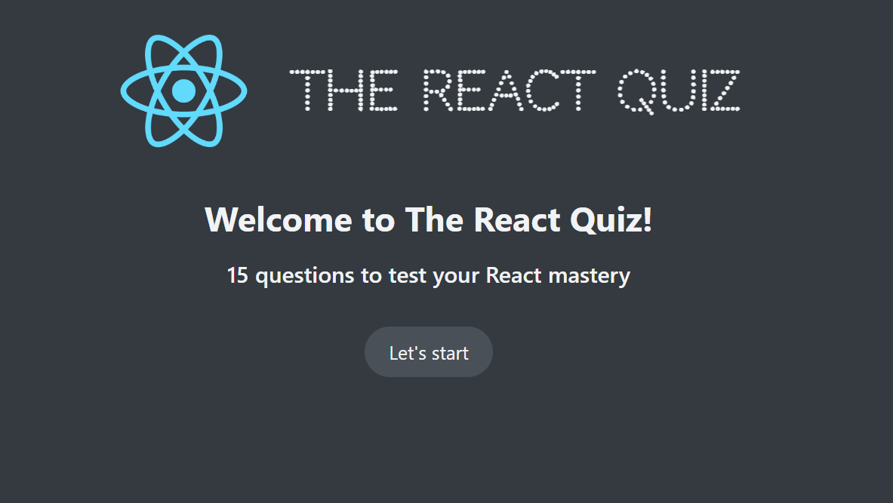
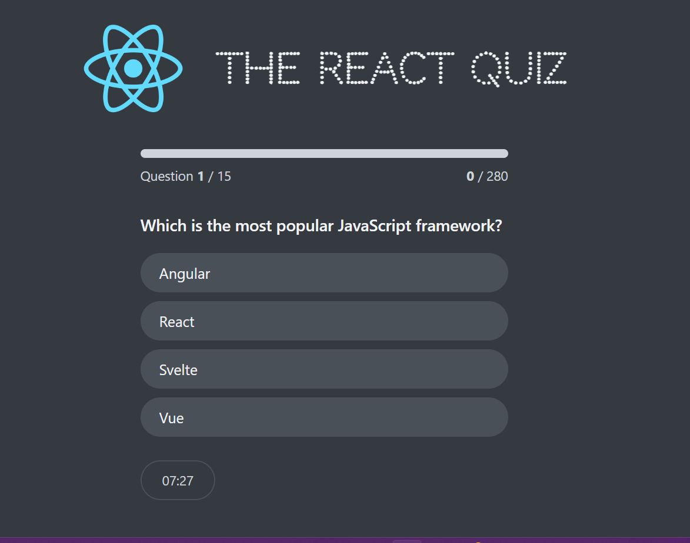

# 🧠 React Quiz App

A dynamic and interactive quiz application built using **React**, utilizing `useReducer` for complex state management and `useEffect` for side effects like data fetching and timing. This project demonstrates modern React patterns and component-based architecture.

---

## 🚀 Features

- ✅ Multiple-choice quiz questions
- ✅ Score tracking and feedback
- ✅ Timer functionality
- ✅ State management using `useReducer`
- ✅ Side effects handled with `useEffect`
- ✅ Clean and responsive UI
- ✅ Easily extendable for different quiz topics

---

## 🛠️ Tech Stack

- **React** (Functional Components)
- **JavaScript**
- **useReducer** for state logic
- **useEffect** for side effects
- **HTML + CSS**

---

## 📸 Screenshots

### 🏠 Home Page


### 🏠 Quiz Page



---

## 📂 Project Structure

```bash
react-quiz-app/
├── public/
│   └── index.html
├── src/
│   ├── components/
│   │   └── Question.js
│   │   └── Timer.js
│   ├── App.js
│   ├── reducer.js
│   ├── data.js
│   ├── index.js
│   └── styles.css
├── package.json
└── README.md

## 📂  Installation & Run Locally

git clone https://github.com/your-username/react-quiz-app.git
cd react-quiz-app
npm install
npm start
